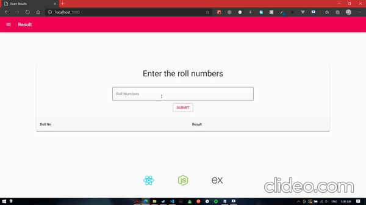
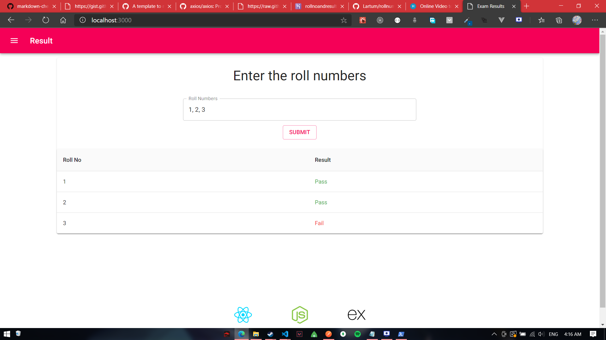
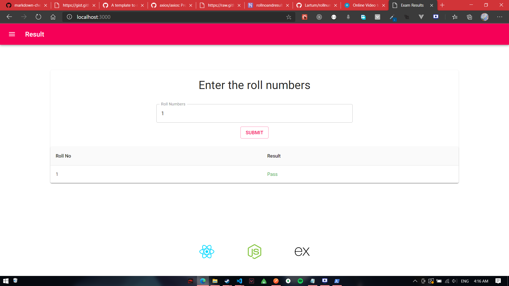
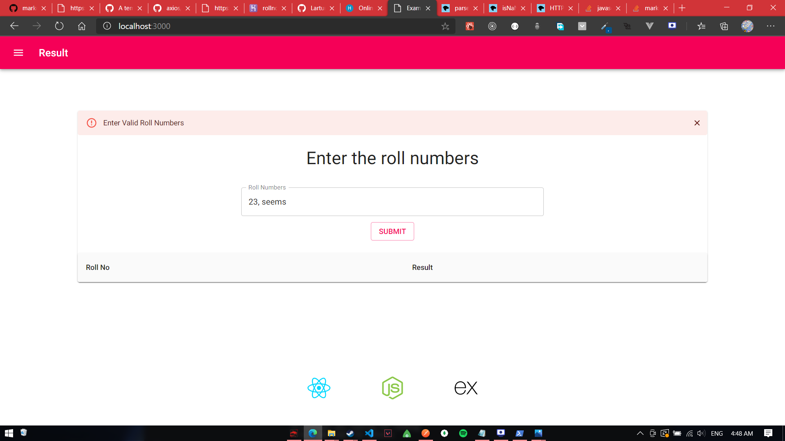
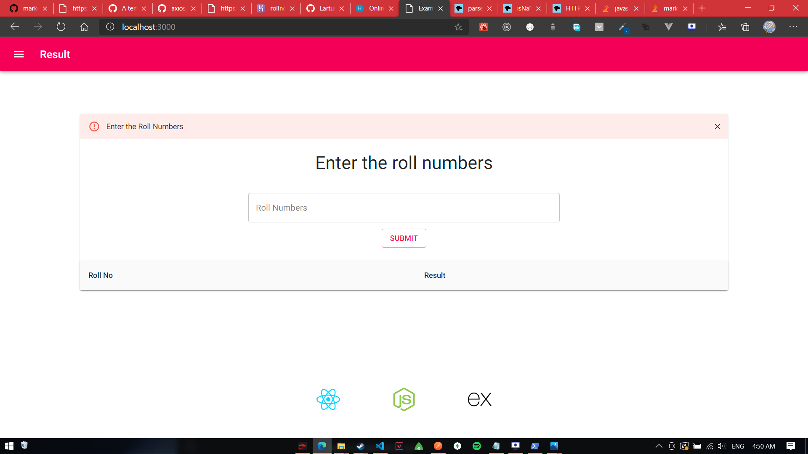

# Roll numbers and results

<a href='https://rollnoandresult.herokuapp.com'>Live Demo</a>

## Table of Contents

 -[Description](#description)
 -[Getting Started](#getting-started)
 -[Dependencies](#dependencies)
    -[Frontend](#fronted)
    -[Backend](#backend)    
 -[Example](#example)
 -[Test Cases](#test-cases) 
 -[Code Section](#code-section)
    -[Frontend Code](#frontend-code)
      -[Handling Submit](#handle-submit)
      -[Table](#table)
    -[Backend Code](#backend-code)
      -[Result Route](#result-route)
      -[Result Function](#result-function)
       
## Description

This project is an assignment from proedge skill development and edutech, to develop frontend and backend for an app that accepts comma seperated roll numbers from the user and calls external api from the backend and displays the result.

## Getting Started
clone this repo: https://github.com/Lartum/rollnumberandresult.git
```
Run "npm i" in the root directory
Run "npm i" in the client directory
Run "npm run dev" to start both the frontend and backend at the same time

```
## Dependencies

### Frontend
<a href='https://material-ui.com/getting-started/installation/'>Material UI core</a>
<a href='https://material-ui.com/components/about-the-lab/'>Material UI lab</a>
<a href='https://material-ui.com/components/material-icons/'>Material UI Icons</a>
<a href='https://github.com/axios/axios'>Axios</a>

### Backend
<a href='https://www.npmjs.com/package/body-parser'>Body Parser</a>
<a href='https://expressjs.com/'>Express</a>
<a href='https://www.npmjs.com/package/got'>got</a>

#### Dev Dependencies
<a href='https://www.npmjs.com/package/concurrently'>Concurrently</a>
<a href='https://www.npmjs.com/package/env-cmd'>env-cmd</a>
<a href='https://nodemon.io/'>nodemon</a>

## Example


## Test Cases
  Request  | Response | Screenshot
 --------- | -------- | ----------
 1, 2, 3    | [{"1":"Pass"},{"2":"Pass"},{"3":"Fail"}] | 
 1          | [{"1":"Pass"}]                           | 
 23, seems  | {error:'Please Enter a Valid Rollnumber'} | 
 null       | {error:'Enter The roll numbers'}          | 


 ## Code Section

 ### Frontend Code
 React.js Code with normal Js 

 #### Handling Submit
 Handle submit validates the array of roll numbers 
 * Validation
    * Check For Empty value being submitted
    * Check if there is non number being passed
 ```js
  const handleSubmit = async () => {
        if(!rollnos){
            setError('Enter the Roll Numbers')
            setCloseError(false)
            return
        }
        const invalidrollnumbers = await rollnos.split(',').some(isNaN)
        console.log(invalidrollnumbers)

        if(invalidrollnumbers){
            setError('Enter Valid Roll Numbers')
            setCloseError(false)
            return
        }
        setLoading(true)
        setDisableButton(true)
        setResult(null)
        const response = await axios.post('/api/result', { rollnos })
        if (response) {
            if(response.status === 406){
                setError(response.data)
                return
            }
            setResult(response.data)
            setLoading(false)
            setDisableButton(false)
        }

    }
 ```

 ### Table
 Render the table only when the results from the API is obtained else render Skeleteon animation.

 ```jsx
    {results ? results.map((result) => {
                                    return(
                                   <TableRow key={Object.keys(result)}>
                                       <TableCell>
                                           {Object.keys(result)}
                                       </TableCell>
                                       <TableCell>
                                           { Object.values(result)[0] === 'Pass' ? 
                                            <Box color='success.main'>Pass</Box> :
                                            <Box color='error.main'>Fail</Box>
                                            }
                                       </TableCell>
                                   </TableRow>
                                    )
                                })
                             :  rows.map((row) => (
                                <TableRow>
                                    <TableCell key={row}><Skeleton width="20%"/></TableCell>
                                    <TableCell key={row*100}><Skeleton width="20%"/></TableCell>
                                </TableRow>
                            ))
                                   
                            }

 ```

## Backend Code
Node.js with Express framework

### Result Route
* The input from user is obtained and split into an array and  checked for nonNumbers

* Async/Awaut is used to wait for all the requests to be fullfilled 

* Promise.all ensures that it returns the data only once the async map function completes loop
```js

 const { rollnos } = req.body
    try {
        const rollnoArray = rollnos.split(",")
        rollnoArray.forEach(rollno => {
        if(isNaN(rollno)){
             return res.status(406).send('Invalid Rollnumber')
         }
        })
        const results = await Promise.all(rollnoArray.map(async (rollno) => {
           const result = await resolveResult(rollno)
           return result
        }))
        
        return res.status(200).send(results)                 
    } catch (error) {
        return res.status(400).send(error.toString())
    }

```

### Result Function
* The function makes API call to the external proedge.me server
* This function is called by result route for every element of the loop.
```js

  try {
        const result = await got(`http://proedge.me/test.php?rollnumber=${rollno}`)
        return { [rollno]: result.body }
    } catch (error) {
        return error
    }

```